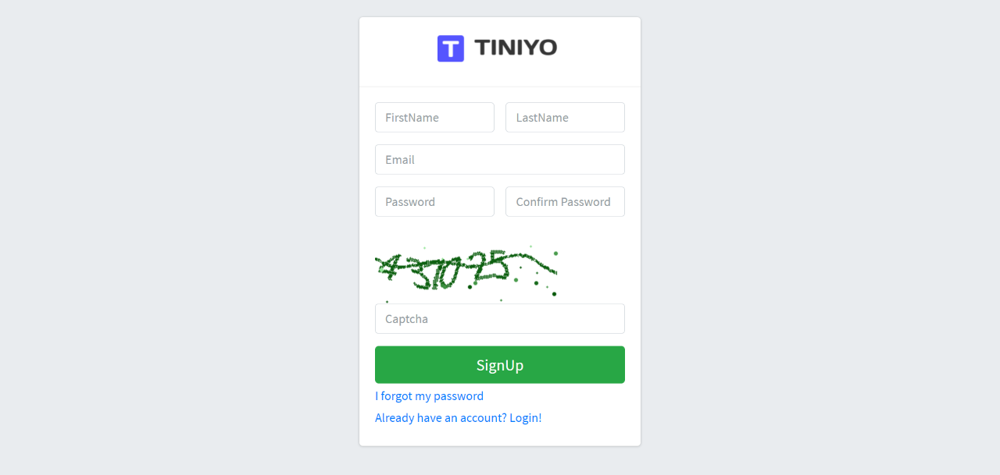
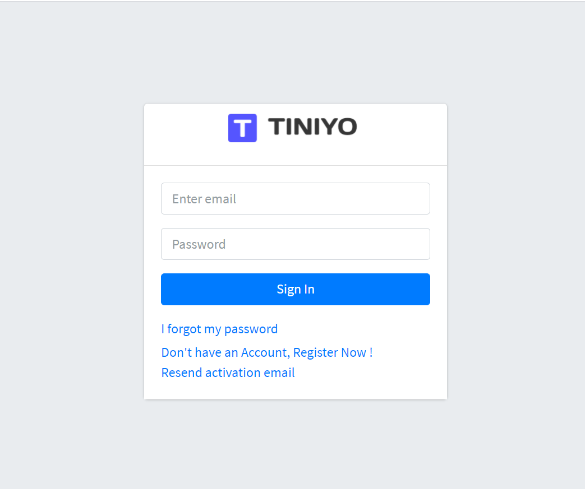
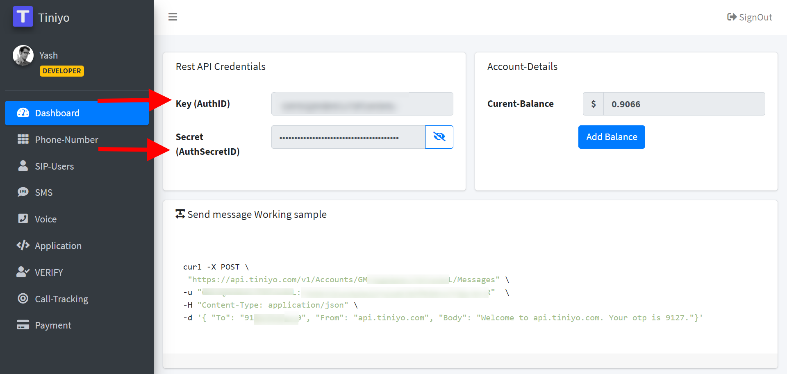
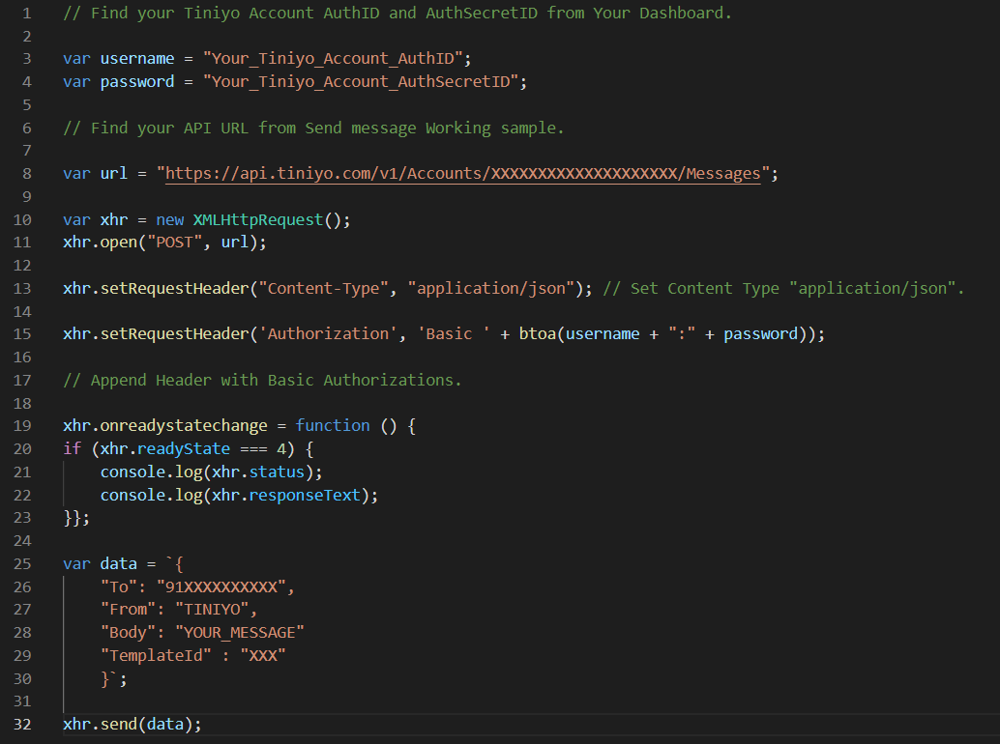
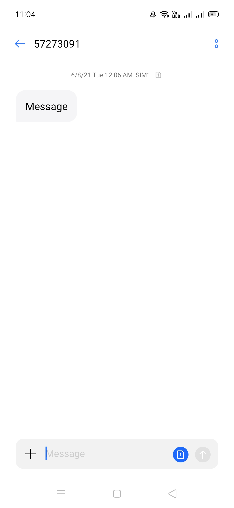

<h1 style="text-align: left;">How to Send SMS With JavaScript Using Tiniyo</h1>

  
 

  

    Using Tiniyo's REST API, you can send outgoing SMS messages from your Verified Tiniyo Phone number to mobile phones around the globe. 
    
 

  

  
What you need&nbsp;

 

To follow this tutorial you will need :&nbsp;

 

1. A Tiniyo Account&nbsp;

 

2. JavaScript Code

 

Tiniyo generates an AuthID&nbsp;and an AuthSecretID when you create a Tiniyo account.

 

 

  <h3 style="background-color: white; box-sizing: inherit; clear: both; color: #333333; font-family: Raleway, Helvetica, Arial, sans-serif; font-size: 1.25rem; line-height: 1.1; margin: 0px auto 0.9375rem; max-width: 100%; overflow-wrap: break-word; padding-left: 0px; padding-right: 0px; word-break: break-word;">Step 1 – Create a Tiniyo Account.</h3>

 

If you already have a Tiniyo account, great!&nbsp; Feel free to skip to Step 2.&nbsp; If not, no worries !&nbsp;Go to&nbsp;<a href="https://www.tiniyo.com/" target="_blank">Tiniyo Official Website</a>. Click on Sign Up.

 

  

&nbsp;&nbsp; &nbsp;

You will redirect to Sign Up page. FIll your details and click on "SignUp" Button.

 

 

 

Now, Your Account is Successfully Created. Verify your Phone Number using OTP.

 

After that Login into your Account using your Email Id and Password.

 

  

   

 

  <h3 style="background-color: white; box-sizing: inherit; clear: both; color: #333333; font-family: Raleway, Helvetica, Arial, sans-serif; font-size: 1.25rem; line-height: 1.1; margin: 0px auto 0.9375rem; max-width: 100%; overflow-wrap: break-word; padding-left: 0px; padding-right: 0px; word-break: break-word;">Step 2 – Get Your AuthID and AuthSecretID from Tiniyo Account.</h3>

 

Once you are logged into your account you will see Dashboard Like below Image.

 

Here, You will Find your AuthID and AuthSecretID for Request API.

 

 

  

    

Copy Your Key and Secet provided by Tiniyo and Store it.

 

Once you've got all that, let's dive into the code.

  <h2 style="background-color: white; box-sizing: border-box; color: #444444; font-family: Whitney SSm A, Whitney SSm B, Helvetica Neue, Helvetica, Arial, sans-serif; font-size: 2rem; font-weight: 300; letter-spacing: -0.16px; line-height: 1.4; margin: 1.7rem 0px 15px; padding: 0px;">Getting started with JavaScript</h2>

 

Here is the code for call SMS API using JavaScript. You can use this code with some changes.

 

  

 

Save this code with .js extension.

 

When creating a new message via the API, include the parameters :

<b>To , From , Body,&nbsp;TemplateId.</b>

<b> </b>

<b>To :-&nbsp;</b>This parameter determines the destination phone number for your SMS message. Format this number with country code, e.g., 91XXXXXXXXXX.

 

 

<b>From :-</b>&nbsp;Specifies the Tiniyo Verified Phone number (or)&nbsp; TINIYO that sends this message. This must be a Tiniyo Verified phone number that you own, formatted with country code,&nbsp;e.g., 91XXXXXXXXXX.&nbsp;

 

 

<b>Body :-</b>&nbsp;The Body Parameter&nbsp;includes the full text of the message you want to send, limited to 1600 characters.

 

 

<b>TemplateID :-</b>&nbsp;TemplateID is mandatory field for the country india.

You can get this Id from Verify -&gt; Verify-Template using tiniyo account.

 

 

<h1 style="text-align: left;">&nbsp;Output :</h1>

 

  
    

    
 

  
  That's it, you've sent an SMS message using JavaScript and Tiniyo API.

 

Thank You,

 

<b>Yash Joshi.</b>

